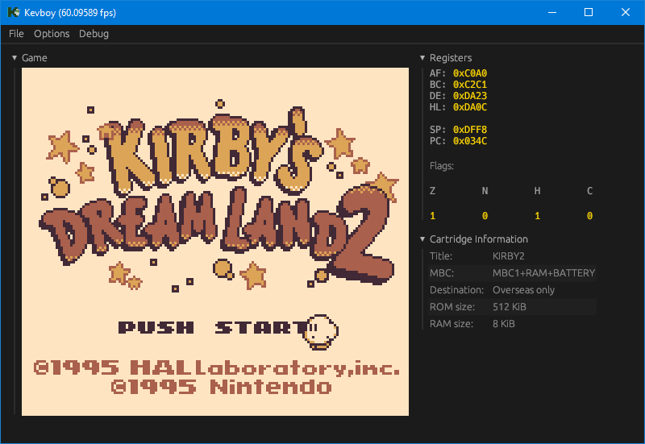

# WIP Game Boy (DMG) Emulator

## Installation

- Clone with `git@github.com:xkevio/kevboy.git`
- Build the project in release mode with `cargo`: `cargo build --release`

## Usage

Open a ROM via `File > Open ROM`.

A boot rom is not provided, the state of the Game Boy after the boot rom finishes is emulated.

Serial (link cable) is emulated in so far that games that rely on it do work, though no emulation of actual linking between two Game Boys is implemented.

**Supported Memory Bank Controllers:**

- **MBC0**
- **MBC1**
- **MBC2**
- **MBC3** (without RTC)
- **MBC5**

## Controls:

Controls may be customized via `Options > Controls`. For manual editing (not recommended, key order needs to be preserved), settings are stored here:

- Linux: `/home/UserName/.local/share/Kevboy`
- macOS: `/Users/UserName/Library/Application Support/Kevboy`
- Windows: `C:\Users\UserName\AppData\Roaming\Kevboy`

Some keys might not be supported.

For a full list, see: https://docs.rs/egui/latest/egui/enum.Key.html

|   **Keyboard**   | **Game Boy** |
|:----------------:|:------------:|
| <kbd>O</kbd>     | `B`          |
| <kbd>P</kbd>     | `A`          |
| <kbd>W</kbd>     | `Up`         |
| <kbd>A</kbd>     | `Left`       |
| <kbd>S</kbd>     | `Down`       |
| <kbd>D</kbd>     | `Right`      |
| <kbd>Enter</kbd> | `Start`      |
| <kbd>Q</kbd>     | `Shift`      |

## Passed tests:

### CPU tests:

| Test              | Status |
|-------------------|--------|
| `cpu_instrs.gb`   | ✅     |
| `mem-timing.gb`   | ✅     |
| `instr_timing.gb` | ✅     |

### PPU tests:

| Test              | Status |
|-------------------|--------|
| `dmg-acid2.gb`   | ✅     |
| `sprite_priority.gb`   | ✅     |

### Timer tests:

| Test                   | Status |
|------------------------|--------|
| `div_write.gb`         | ✅      |
| `tim00.gb`             | ✅      |
| `tim00_div_trigger.gb` | ✅      |
| `tim01.gb`             | ✅       |
| `tim01_div_trigger.gb` | ✅       |
| `tim10.gb`             | ✅       |
| `tim10_div_trigger.gb` | ✅       |
| `tim11.gb`             | ✅       |
| `tim11_div_trigger.gb` | ✅       |
| `tima_reload.gb`       | ✅       |

### Misc. tests:

*// TODO*
